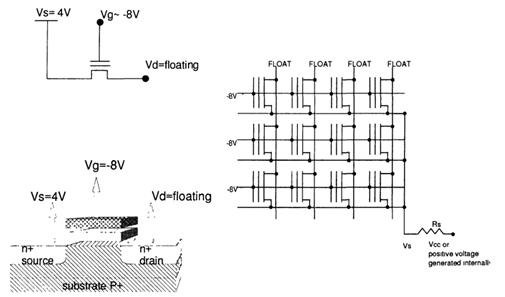

### 1. 引言
现今主流的非挥发存储器主要包括EEPROM、NOR FLASH和NAND FLASH。在实际应用中，主要关心这几类产品的以下特性：

* 产品容量，包括扇区大小
* 工作电压范围
* 操作速度，包括读出速度和擦写速度
* 擦写次数
* 数据保持时间
* 功耗
* 成本和价格竞争力

#### 1.1 EEPROM（电可擦可编程只读存储器）：

* 采用浮栅结构的存储单元CELL，每个包含2个晶体管：选择管和浮栅存储管。
* 容量通常以K数量级计算。
* 拥有优越的擦写和数据保持可靠性，擦写次数可达百万次，数据保持时间可达等效100年。
* 数据灵活改写，可以逐字节改写而不影响其他存储阵列的内容。
* 接口类型有并行、串行IIC和串行SPI。
#### 1.2 NOR FLASH（非门存储器）：

* 存储单元CELL源自EEPROM，采用浮栅单元，但每个存储单元只包含1个晶体管，从而实现更高的集成密度。
* 容量通常以M数量级计算。
* 擦写次数约为10万次，数据保持时间约为等效10年。
* 在可靠性和容量之间取得平衡，在业界应用广泛。
* 采用扇区擦除、字节改写的方式来改写数据。
* 接口类型有并行接口和串行SPI，适合存放程序和进行随机地址访问。
#### 1.3 NAND FLASH（与非门存储器）：
 
* 存储单元CELL结构类似于NOR FLASH，采用浮栅晶体管，但访问方式不同。
* 存储单元串联在一起，源和漏相互连接，类似于数字电路的与非门结构。
* 它适合地址连续的读出，用于数据存储场合。
* 编程和擦除时需要较高的电压，对可靠性和寿命提出挑战。
* 接口类型有并行ONFI接口、DDR接口和串行SPI接口。

总的来说，EEPROM具备优越的擦写和数据保持可靠性，适合灵活改写数据；NOR FLASH在可靠性和容量之间取得平衡，适合存放程序和随机地址访问；而NAND FLASH适合地址连续的读出，更多被应用于数据存储场合。三种存储器件在接口类型上有所差异。

### 2 NOR FLASH单元操作和阵列架构
NOR FLASH阵列将NOR FLASH的单元按行和列排列在一起，行称为字线WORDLINE，列称为位线BITLINE。多个存储单元的栅极连接在同一字线上，多个存储单元的漏极连接在同一位线上。一个扇区中所有存储单元的MOS管的源端和衬底都连接在一起，通过重复这种结构8或16次，形成8位（字节）或者16位（字）输出的存储结构。
  
图 1 NOR FLASH结构图(RB3 - Flash Memories (1999) P17 figure1.9)

#### 2.1 读出操作
NOR FLASH存储器的读出操作将选中的存储单元MOS管的阈值信息输出为0或1的数字值。通常存储单元采用浮栅MOS管结构，其中浮栅中注入电子时，阈值高，读出为0；浮栅中没有电子或有空穴时，阈值低，读出为1。在读操作时，选中的字线被偏置在约5V的读电压上，选中的位线被偏置在约1V的读电压上。读出操作通常至少以8位（字节）或16位（字）同时进行，近期产品也可能存在以页为单位的更多位宽的读出操作方式。

存储单元的读出方式有多种，其中最常用的方法是通过比较器电路来比较存储单元的电流来实现。这种方式需要将被访问的存储单元与一个参考单元进行比较，参考单元一般也是同样结构的浮栅MOS管。通过比较器电路后，将最终结果转换成数字信号并输出。

  
图 2 NOR FLASH读操作原理图

#### 2.2 编程操作
编程操作将电子注入浮栅并提升浮栅MOS管的阈值，采用沟道热电子效应（HOT-CARRIER）实现。选中的浮栅MOS管的栅端加一个约10V的高电压，同时漏端施加一定的高压来得到热电子。漏端高压一般比VCC高，但必须谨慎设置以防止电压过高造成结击穿、沟道击穿、增益退化等危险效应。编程时栅干扰和漏干扰都是需要考虑的因素。NOR FLASH擦写次数是有限的，受到多种因素的影响，其中包括：

* 单元沟道长度、宽度和耦合比。
* 温度。
* 栅和漏的编程高压。
* 隧道氧化层质量。

  
图 3 NOR FLASH编程操作原理图

#### 2.3 擦除操作
擦除操作是将电子从浮栅中扫出，或者将空穴注入浮栅，从而降低浮栅MOS管的阈值。由于NOR FLASH阵列的组织结构，擦除操作同时作用于一个扇区内的所有浮栅MOS管。擦除操作使用FN隧穿效应（FN-TUNNELING）来实现，隧穿效应可以发生在源端或者沟道。

擦除操作方式：
* 包括在源极施加正高压
* 在源极采用恒流源电路施加恒定电流以获得固定场强
* 在源极和衬底施加正高压，在栅极施加负高压(最常用)

擦除时间受到施加电压幅度、隧道氧化层厚度等因素的影响。在NOR FLASH擦除中，可能出现过擦除问题，即单元阈值擦除到负阈值，影响相同位线上其他单元的读出电流。为了纠正过擦除，需要引入纠正算法，这增加了擦除过程的复杂性并降低了擦写寿命。
  
图 4  NOR FLASH源极擦除操作原理图

  
图 5  NOR FLASH栅极负压操作原理图

**NOR FLASH存储器在擦除和编程操作中所需的高压电源，以及NOR FLASH器件的电源供电方式的演变:**
1.NOR FLASH擦除和编程操作需要比VCC高的电压和比GND低的电压。
2.外部可以提供这些高压电源，也可以由芯片内部产生。
3.早期的NOR FLASH器件采用多组电源供电方式，其中VCC用于FLASH芯片的逻辑电路区域，VPP提供编程或擦除时的高压。这增加了对系统电源的复杂性，并且很多多电源擦写需要通过编程器实现。
4.现在主流的NOR FLASH采用单一电源，擦除和编程所需的高压由芯片内部电压泵产生。这简化了对系统电源的要求，使得现在的NOR FLASH可以摆脱对编程器的依赖，方便在系统板上实现数据的改写。

**NOR FLASH存储阵列结构**
*NOR FLASH 存储器的操作和结构：*

1.通过行列译码电路，特定的存储单元可以被选中。
2.通过源极驱动电路，需要被擦除的单元会被加上特定的擦除电压。
3.现在主流的器件一般有 8 位字节模式或 16 位字模式，有些器件甚至有 32 位宽模式。
4.存储阵列中的每个位在位宽中都有对应的列区域，通过读出电路将存储单元中存储的数据内容转换为输出。
5.所有存储单元的源极都是连接在一起的，因此全片的所有存储单元都会同时被擦除。
  
图 6 全片同时擦除的NOR FLASH架构图
同一个NOR FLASH器件可以在不同场合同时支持8位或16位模式，用户可以通过设置BYTE#管脚来选择字节模式或字模式。器件内部默认工作在16位模式，在输出控制时决定输出高8位或低8位，或者同时输出16位。

最早期的NOR FLASH只能进行全芯片同时擦除，无法对其中的某些区块进行单独的擦除，因为当时NOR FLASH存储阵列的架构中所有浮栅MOS管的源和衬底都是物理连接在一起的。

扇区擦除概念的引入解决了这个问题。整个NOR FLASH存储阵列被划分为多个独立的扇区，每个扇区内的浮栅MOS管的源极连接在一起，但与其他扇区独立。通过源驱动电路控制不同扇区的源极切换，从而实现对任意扇区的擦除，而不擦除其他扇区的内容。

每个扇区的大小可以根据实际需求进行定义，可以相同或不同。这种基于独立扇区的架构使得可以实现特定功能，如BOOT扇区。BOOT扇区可以根据系统BOOT需求定义，设定特殊大小并设置写保护机制，从而防止重要的BOOT扇区被误写

在有外部供应VPP（编程/擦除电压）的情况下，通常使用源极擦除的方式来进行擦除操作。源极擦除的优势在于擦除时浮栅单元的源极可以获得一个高压，从而擦除时栅极不需要负压，而是直接接地。

NOR FLASH存储阵列的不同扇区的单元通常共用字线，但漏极和源极却不会连接在一起。因此，扇区的划分会通过列的方向来实现，这种架构结合源极擦除的方式，也可以实现只擦除一个扇区内的部分单元。
以下两张图分别从扇区维度和输出维度给出了独立扇区分布的阵列架构。
  
图 7 从扇区维度区分扇区架构示意图
  
图 8 从输出维度区分扇区架构示意图
以上的架构都有利有弊：当扇区划分越细，操作会更加灵活，但同时也会带来更多更复杂的切换电路和读出放大电路，以及更多的独立源极驱动线网等，增加了系统的复杂性和成本。

另外，如果采用栅极负压擦除的方法，扇区也可以在行的方向上进行划分。在这种情况下，擦除时要给需要擦除的扇区的栅形成的行加上负压，而不需要擦除的行则需要连接到GND上。
NOR FLASH存储器的扇区大小在理论上没有限制，但在实际应用中会进行综合考虑，进行折中设计，考虑以下因素：

源极连线的拆分和增加源驱动切换电路，以实现更灵活的扇区操作。
字模式和字节模式切换带来的复杂连线问题。
电路复杂化以及更昂贵的冗余成本。
擦写可靠性对扇区大小的影响。
对于单电源电压的NOR FLASH存储器（只提供一个VCC供电端），通常在行的方向上拆分扇区。图示中说明了位线的连接原理，不同扇区的字线完全独立，但位线有连接，不同扇区内的位线会连接到全局位线上。通常M1用于扇区内的位线，而M2用于全局位线。但在没有M3辅助的情况下，字线只能通过POLY连接而无法通过M3降低阻抗，从而导致字线建立时间变长，读取速度变慢。
  
图 9  基于单电源的负压擦除FLASH阵列架构示意图